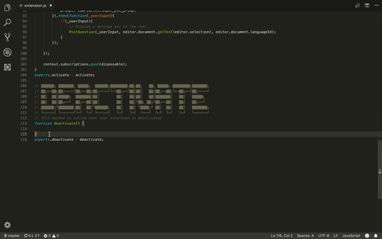

# Hey

Hey allows you to ask code-related questions by selecting code right from your IDE.

## Install

https://marketplace.visualstudio.com/items?itemName=hey.vscode

## Requirements

None.

## Known Issues

None.

## Release Notes
